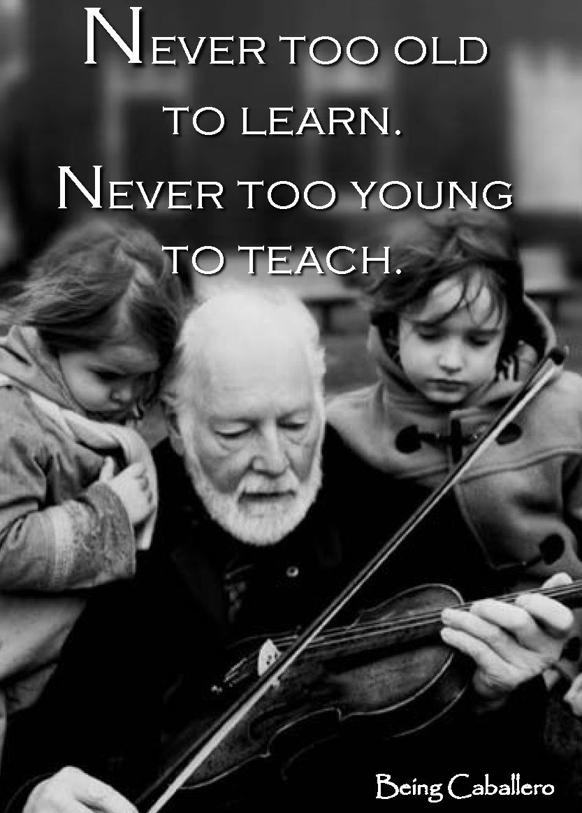

When I first graduated from university in Nigeria and did the mandatory National Youth Service, I was 23. I thought I was old. Two years earlier, a school friend had dropped out from the university in his fourth year to go to Canada and start all over from first year. I thought to myself, “What, I could never do that!” This was happening in 2009. In 2021, 12 years later and by Nigerian standards, that is enough time to have either gone through undergraduate medical school twice, had three regular undergraduate degrees, or done a combination of an undergraduate, Master's and a doctoral degree all assuming that the person started in 2009.

At that time I felt that I was already old and thought that I could not possibly start from first year of university. However in the past two years, I have met people who started even more recently, like say 2014 and are almost at the end of their PhD. It then means I could have started a new undergraduate degree in a field that I really wanted such as Software Engineering and by now, I’d probably have a PhD in that or a related area.

I recently applied to PhD programs in which the lead scientist or researcher graduated from their bachelor’s after I did. It made me think that when they saw my application they could have wondered, “What has he been doing all this time?”

The underlying reason for the circumstances expressed in this post are a complex and complicated interplay between the psychology of a person and the influence of the environment. Many times I was mentally stuck in a rut and all I wanted to do was get out of this *thing*. One issue I had was that I would not attempt anything else until I solved the problem. Another issue was I wanted to do it alone. This idea of getting out of the rut alone was my undoing because it led to my staying stuck longer than I should have. We say that if you fall, you should get up. Depending on where you fall, one way to get up is to ask someone to help you up. Give your hand and take another’s. They pull, you heave and out you get.

Many times in the recent past, I have reflected on this and it is obvious how much time was lost being stuck. It is particularly pertinent because my temperament has not changed. One of the things about the old situation was that I was always replaying the past and trying to change it in my head. Sometimes it changed, sometimes it didn’t but no matter how you rescript your past in your head, you can’t change it in other people’s heads. Thank God for books like Émile Coué’s Autosuggestion and for friends who were lavish with encouragement. Without these things, I’d have been stuck still. That fixedness really had to be left behind and one can be tempted to do *anything* to be free of it.

After making progress in getting out of the clog, I no longer feel old. I took a Master’s degree where, in spite of all the negative tapes playing constantly in my head, more from habit than from anything else, I graduated well. Mind you, I didn’t get the grades I would have loved, or even the ones I would have liked but the grades I got, I still like them because though they were not the best I could do, they came from minimal effort and overall was above average.

It gave me hope that in future when the mental dust is settled, I could do way better when I put in maximal effort. The thing is that I started the Master’s program as a way to get out of the environment that contributed to that mental state, and it worked. Surprisingly in having to struggle and succeed at my studies and personal relationships, I got better at dealing with most of the things that led me down the slippery mental road in the first place. And I learnt more about myself during the same time.

I no longer feel old, and were it not for social, economic and personal reasons I would have gone to school to start all over. Fortunately I am a futuristic person. I know that I don’t have to go to school in the sense we know it to do certain things that I love and have always wanted to do. It was never absolutely necessary and it isn’t now. What matters is the knowledge we have and the proof of it. Focusing on acquiring the requisite knowledge in the coming days is what I am going to be doing and I shall find interesting ways to do just that.

Like many people alive today, I am a bundle of what-could-have-been’s: a linguist, an engineer, a doctor, a pilot, a mathematician, a husband and a father. The thing is I am not any of these things but I am alive. And being alive counts for many things. It means that I can still be any of the things I wanted. I’ve chosen the ones I want to be. I am going to work on them and in a number of years, I shall see where I get to with them.

Now this is the point where I have to appreciate a phone call, with my friend Chuks, that put this in great perspective for me. He asked me where I wanted to see myself in 20 years, and as I thought about it, in that split second I realised that if I was still alive I would be in my fifties by then. To me, 50 years isn’t so old and if I still have 20 years till then I am definitely so bloody young. At least with what I’ve learnt from my struggles in the last three years and all the falling and getting up, I feel so very sure that in 20 years a huge lot would have changed and the sadness, mistakes, errors and failures of the earlier 30 years would be completely forgotten.

Rather than worry about where I would be in two years or five, I can work on where I’ll be in twenty and the two and five will fit in nicely. Fact is, I am a late bloomer. I have seen that age is paradoxical. When I was young, I froze mentally because I thought I was old, and now when some of my age mates would count themselves as old, I feel as though I was just born. In the end, what will matter is what comes out of it, and I am so looking forward to this.