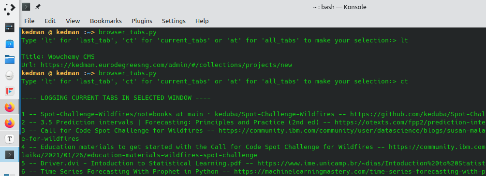

### Save your tabs on Mozilla Firefox.

If you are one of those that don't like to deal with linked and sublinked bookmarks nor interested in having millions of tabs open in your browser and still don't want to have your browser history lying around, here's a solution for you.

This simple script with a few lines of code will allow you to save or print out to your terminal one or all of the three following items.

The url and title of:

1. The current tab in your browser
2. All the tabs currently open in the browser window you are looking at
3. All the tabs in all the windows you currently or last had open.

How cool is that! 

Anyway, being a semi-perfectionist means that I'm going to be tweaking it from time to time. However, it's still very much serviceable even now.

```python
#! /usr/bin/python3
import sys
import json
import os
import glob
import lz4.block as lz4

SESSION = 'recovery.jsonlz4'
filename = glob.glob(os.path.join(os.path.expanduser('~'), '.mozilla','firefox','*default*','sessionstore-backups', SESSION))[0]

in_file_handle = open(filename, "rb")

# using the lz4 library to uncompress
with open('jf.json', 'wb') as jf:
    assert in_file_handle.read(8) == b"mozLz40\0"
    jf.write(lz4.decompress(in_file_handle.read()))

# saving the uncompressed file to json for use
with open('jf.json', 'rb') as jf:
    mybr = json.load(jf)

# Constants
CURR_WIN = mybr.get('selectedWindow') - 1
CURR_TAB = mybr.get('windows')[CURR_WIN].get('selected') - 1
CURR_IND = mybr.get('windows')[CURR_WIN].get('tabs')[CURR_TAB].get('index') - 1

# Verify if you have written your options on the command line 
if len(sys.argv) > 1:
    selection = sys.argv[1]
else:
    selection = input("Type 'lt' for 'last_tab', 'ct' for 'current_tabs' or 'at' for 'all_tabs' to make your selection:> ")

#current_selected_tab:
if selection in ('last_tab', 'lt'):
    murl = mybr.get('windows')[CURR_WIN].get('tabs')[CURR_TAB].get('entries')[CURR_IND].get('url')
    mtitle = mybr.get('windows')[CURR_WIN].get('tabs')[CURR_TAB].get('entries')[CURR_IND].get('title')
    print(f'\nTitle: {mtitle} \nUrl: {murl}')
elif selection in ('current_tabs', 'ct'):
# current tabs in selected window
    print("\n---- LOGGING CURRENT TABS IN SELECTED WINDOW ----\n")
    window = mybr.get('windows')[CURR_WIN]
    for j, tab in enumerate(window.get('tabs')):
        i = tab.get('index') - 1
        tab_url = tab.get('entries')[i].get('url')
        tab_title = tab.get('entries')[i].get('title')
        print(f'{j+1} -- {tab_title} -- {tab_url}')
elif selection in ('all_tabs', 'at'):
# current tabs in all window
    print("\n---- LOGGING CURRENT TABS IN ALL WINDOWS ----\n")
    for k, window in enumerate(mybr.get('windows')):
        print(f"---- LOGGING CURRENT TABS IN WINDOW {k}----\n")
        for j, tab in enumerate(window.get('tabs')):
            i = tab.get('index') - 1
            tab_url = tab.get('entries')[i].get('url')
            tab_title = tab.get('entries')[i].get('title')
            print(f'{j+1} -- {tab_title} -- {tab_url}')
else:
    print("You didn't make the right selection.")
```

**Usage:**

Just a simple explanation to its usage.  The syntax for using it is quite simple. `python3 <script name> <file option>` . In this case `script name` refers to the name of the script as you prefer to save it. In my case it's `browser_tabs.py`. Then the file option is one of three: 

* For the first, the current tab you are on, or the last tab before you went to the terminal, the option is *last_tab* or *lt*.

  `python3 browser_tabs.py last_tab` or `python3 browser_tabs.py lt`
* The option to have all the tabs currently open on the window you are looking at or the most recent window you looked at is *current_tabs* or *ct*.

  `python3 browser_tabs.py current_tabs` or `python3 browser_tabs.py ct`
* And if you want to save all the tabs from all the windows currently open, then type *all_tabs* or *at*.

  `python3 browser_tabs.py all_tabs` or `python3 browser_tabs.py at`

For this particular script, using the version on the command line gives the added flexibility of allowing you pipe the output to a file, like so:

`python3 browser_tabs.py last_tab > myLastTabs.txt` 

Of course, if you don't type in the arguments last_tab, current_tabs or all_tabs it will ask you for your choice and you can enter it in on the terminal, then copy your results. Either way works fine.

Here's how it looks in action:



Like I said earlier, it's still work in progress and there are yet a thousand ways I can make it better but in the spirit of agile development, here's something you can get started with. Enjoy!